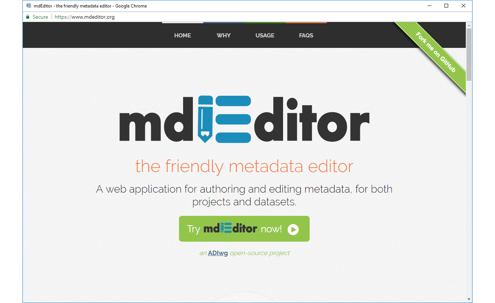
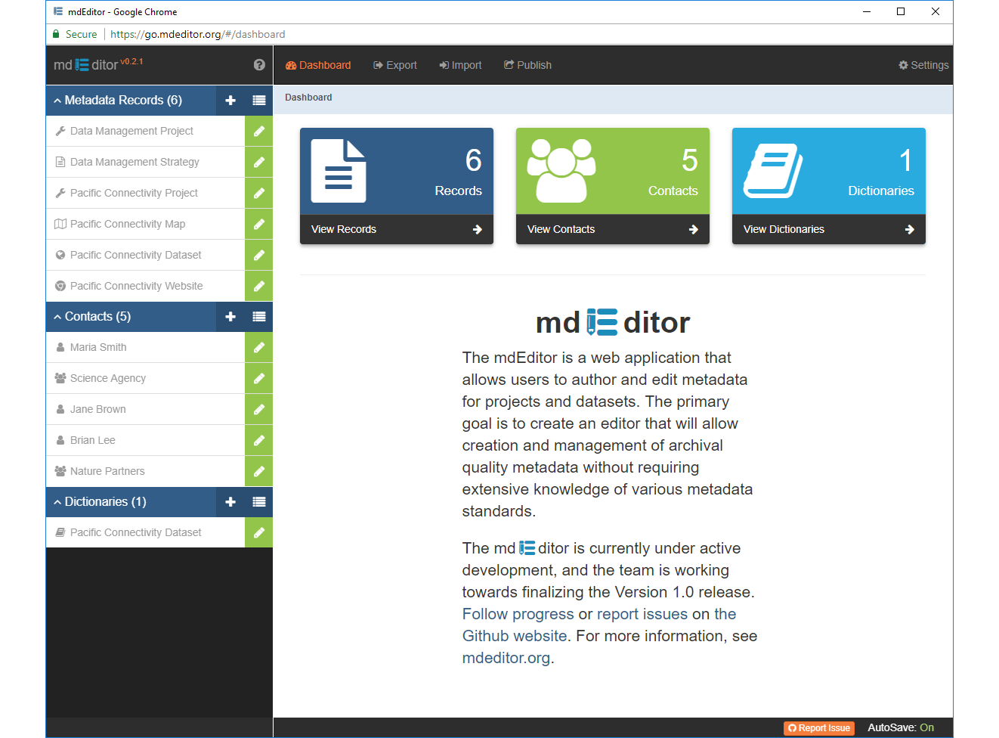

# Starting Up mdEditor
---
Now that you have learned about the mdJson format used by mdEditor and how mdEditor manages its files on your computer, let's start up mdEditor. Oh, if you don't know about these things it might be best to back up and read [Before We Begin](before-we-begin.md) *before we begin*.

---
### 1. Open an Internet Browser
You may use the recent version of most popular internet browsers that support [HTML5](https://developer.mozilla.org/en-US/docs/Web/Guide/HTML/HTML5) such as [Chrome](https://www.google.com/chrome/), [FireFox](https://www.mozilla.org/en-US/firefox/), [Safari](https://www.apple.com/safari/), [Opera](https://www.opera.com/), or [Edge](https://www.microsoft.com/en-us/windows/microsoft-edge).  Although we have only thoroughly tested mdEditor with Chrome at this time. 

### 2. Browse to mdEditor home page
Open your browser and point to https://www.mdEditor.org. This should bring you to the mdEditor home page shown below. The home page offers a brief orientation to mdEditor as well as links to supporting resources and other propaganda; and most importantly, a link to mdEditor.  Click the big green button toward the bottom of the page labeled '**Try mdEditor now**'.

 

### 3. Open mdEditor
You should now see the Dashboard of mdEditor.  What you actually see could look different depending on your choice of browser and device.  Since mdEditor is smart enough to reconfigure the display based on available space, it will appear quiet differently on your mobile device than on your large work place monitor.  However, we are making no recommendation to edit metadata on your mobile phone.  
 

Notice that the left sidebar lists the metadata records, contacts, and data dictionaries loaded into browser cache.  These are *your* records so will be different that those listed here.  

The next time you connect you can save a step and bypass the mdEditor home page by going directly to the mdEditor Dashboard at [https://go.mdeditor.org](https://go.mdeditor.org).  

Now, let's create a first metadata record together!

> When you open mdEditor you may see an alert message telling you software has changed since your last use and new features may be available.  The message will not interfere with your editing.  Just read the message, close it, and continue. 

